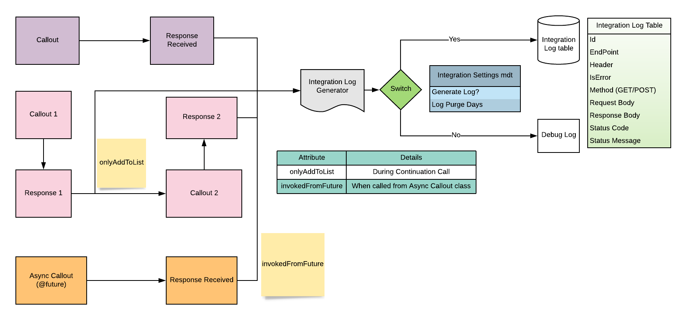

# IntegrationLogFramework
Simple reusable and extensible integration logger class with data structure for ready to use in any project.

<a href="https://githubsfdeploy.herokuapp.com?owner=Capgemini-Salesforce-CoE&repo=IntegrationLogFramework">
  
</a>

Logging during integration is required for troubleshoot and audit purpose. This ready to use framework can plugs in with apex classes and logs the payload details for request and response in a separate Integration Log table.
- Logging can be Turned ON/OFF with external switch (Custom Metadata)
- In case of back to back callout in single transaction, Logs can be stacked and committed at end.
- Logs are always committed asynchronously.
- If Callout is made in asynchronous way then logs can be made in that same transaction.

Architectural diagram shown below - 



## Usage

1. **After Callout - **
    Example given at `integrationLogTestSync` method in `IntegrationLogGeneratorTest' class.
```java
    IntegrationLogGenerator.generateIntegrationLog(request, response,
                                                        new Map<string, string>{'headerKey'=> request.getHeader('headerKey')}
                                                         ); 
```
2. ** During Continuation Callout - **
    Example given at `integrationLogTestContinuation` method in `IntegrationLogGeneratorTest' class.
```java
     IntegrationLogGenerator.onlyAddToList = true;
    IntegrationLogGenerator.generateIntegrationLog(request, response,
                                                    new Map<string, string>{'headerKey'=> request.getHeader('headerKey')}
                                                        );
```
3. ** If Callout is made asynchronously - **
    Example given at `integrationLogTestAsync` method in `IntegrationLogGeneratorTest' class.
```java
     IntegrationLogGenerator.invokedFromFuture = true;
    IntegrationLogGenerator.generateIntegrationLog(request, response,
                                                    new Map<string, string>{'headerKey'=> request.getHeader('headerKey')}
                                                        ); 
```
